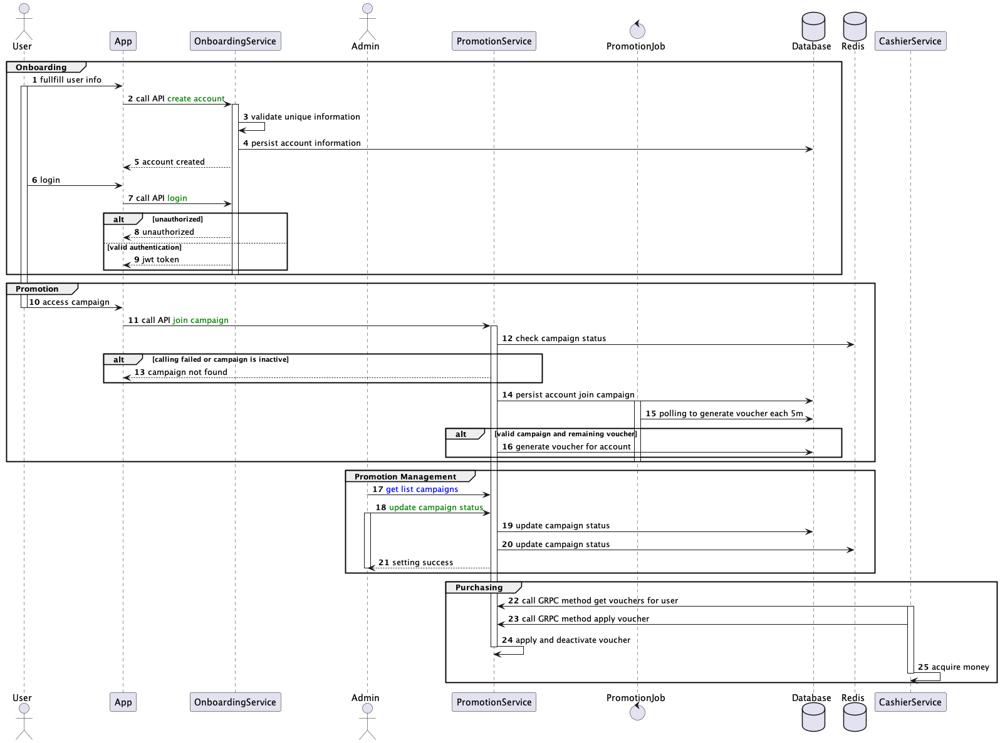

# Financial-Service-Example

Handling auth and promotion for financial service

# Installation
To get started with this project you must install docker and docker-compose. You can find the installation guide [here](https://docs.docker.com/get-docker/).
```bash
docker-compose up -d
```
# Documents
## System Overview

## [OpenAPI Swagger](./api/docs)
## [DB Design](./docs/db)

# Structure and System Design
## Structure
```
.
├── Dockerfile
├── Makefile
├── README.md
├── api                         # define api for service
│   ├── docs                    # api documentation generated from proto file
│   └── proto                   # define proto for grpc
├── docs                        # define api for service
│   ├── db                      # db docs
│   └── sequence                # sequence docs
├── cmd                         # command to execute service: http, cronjob, worker, ....
├── configs                     # config for service
│   └── http_server             # config for http server
├── docker-compose.yml          
├── internal                    # contains all the business logic of the application
│   ├──auth                      # auth domain
│   ├──promotion                 # promotion domain
│   ├── adapters                # contains the implementation detail of traffic going out of the system
│   ├── applications            # business logic of the application
│   └── ports                   # receive incoming trafic, parsing to application model
│       ├── grpc                # grpc servers
│       │   ├── service         # grpc promotion user server
│       │   ├── admin           # grpc promotion admin server
│       └── http                # http servers
├──main.go                      # entry point of the application
```